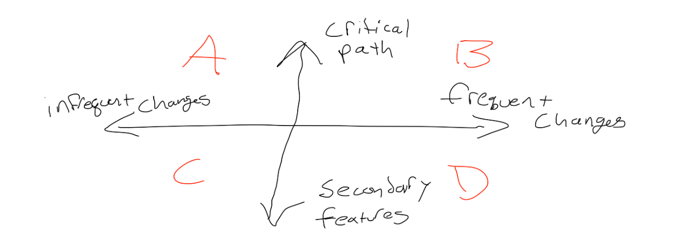

## Vendor Bundle Anti-Pattern

The typical app will code split one bundle for each page, as well as a vendor bundle containing a superset of all dependencies used on all pages. The reasoning cited for using this code splitting strategy is that "you will change your own code more often than you will change your dependencies". I am personally of the belief this is not true or optimal.

[Vendor bundles are an anti-pattern](https://frontendmasters.com/courses/performance-webpack/vendor-bundles-are-an-anti-pattern/) according to Sean Larkin, a webpack contributor.

## Understanding The Tradeoffs

To understand why Sean says vendor bundles are an anti-pattern, let's consider a hypothetical app with two pages, "Page A" and "Page B". Each page uses a distinct, but potentially overlapping set of vendor code.

With the vendor bundle pattern, you would end up with three bundles:

- **pageA.js** - 10k contains just the content for pageA.js
- **pageB.js** - 10k contains just the content for pageB.js
- **vendors.js** - 138k contains the superset of all dependencies used on all pages on the site

Is having this giant vendor bundle bad? Like many things, it depends. First, let's consider a user who only loads page A and bounces. They will need to download both **vendors.js** and **pageA.js**, a total of 148k, but in reality no more than 74k of that code could be executed. Even if the user returns later and the code is cached in their browser, there is a cost to parsing & evaling that code which is not mitigated by caching, especially on mobile devices as Sean Larkin points out.

The tradeoff here is that later when the user navigates to page B, they will probably only need to download a 12k bundle. Also the larger vendor bundle can compress better in theory since larger files can benefit more from compression than many smaller files. If you're not using http2, the number of network requests can also affect your loading time.

## An Alternative Idea For Code Splitting

How should we split our code? The way I see it, there is a quadrant.

Along the **vertical** axis, we have a spectrum of how critical the code is. Code that is needed to render above the fold content is critical. Code that is only needed if the user interacts with a rarely used or less important feature is less critical and can probably be deferred.

Along the **horizontal** axis, we have a spectrum for how often the code changes, for example if you upgrade to a new version of React only once a year, but you change your content hourly, these codes would sit on opposite ends of the horizontal spectrum.

## Visualizing Optimal Code Split Points

How do you know which quadrant your code sits in? One way is to use my heatmap visualization tool. By extracting the [code coverage from Chrome](https://developers.google.com/web/updates/2017/04/devtools-release-notes#coverage) we can overlay the raw coverage information on a [tree view visualization](https://en.wikipedia.org/wiki/Tree_view) like [source-map-explorer](https://github.com/danvk/source-map-explorer/pull/145). Here each box is a module, and the color gradient corresponds to what percentage of the code executed. This is a visualization of the video player component used on [twitch.tv](https://twitch.tv), where I have redacted the names of the modules for confidentiality.

The red boxes correspond to code that never executed while we were collecting the coverage. The reason the code did not execute could be numerous, a non inclusive list:

- We executed the code for and mounted a button, but not the components clicking the button would reveal.
- Code for multiple versions of an inline A/B experiment may have been served to the user.
- Some "initialization" logic ran, but the bulk of the code never ran.
  - For example, Sentry error reporting client is quite large but there may be no errors to report.
  - Sentry has a "lazy loader" that registers a listener, buffers errors, and loads the code to process & submit the errors only if errors do occur.

For those features we deem as less important, we would evaluate if they need to be in the critical path, and if not we would split them out & defer them until some condition is met (eg. the user has interacted, or the rest of the page finished loading, or some event has actually fired). Instead of a vendor bundle, we have one or more "deferred" bundles. This tells you exactly where each module sits in the vertical spectrum of my quadrant shown above, or how critical it was.

An idea for another tool would be to visualize how frequently the code changes, by programmatically analyzing the git history & package manager lock file(s), this could be used to determine where code sits in the horizontal axis.

## Waterfall Router Anti-Pattern

Since Sean Larkin coined the "vendor bundle anti-pattern", I want to identify another potential anti-pattern to look out for. The waterfall router manifests when websites create a single webpack entry point that loads their router, and other "core" code. The "core" bundle has to be downloaded, parsed, and evaluated to determine which route the user is on. Only after all of this happens can the router code begin to fetch the content for the page the user actually requested.

As you can see here, there is a waterfall sequence in the above diagram, first we must fetch the "core" bundle, then we must execute it and parse the route, and only then can we determine which page's bundle to begin fetching.

## Entry Points

There is a very elegant solution to fix this, which is called [webpack entry points](https://webpack.js.org/concepts/entry-points/). These entry points inform webpack where users can enter your site. This allows webpack to extract an HTML, and set of JS file(s) optimized for your specific traffic flow. There is a tradeoff here to consider, which is that when the user transitions, we must decide to do a full page reload to the new page's entry point, or we must have a robust router and build system that is smart enough to fetch the JS bundles for page B and load it in without a page reload. Many static site generators like [Gatsby](https://www.gatsbyjs.com/) employ similar routing / entry point strategies.

[Webpack code splitting](https://webpack.js.org/plugins/split-chunks-plugin/) has a number of constraints you can tune like the minimum and maximum size of bundles, and the number of requests per page. I also recommend desiging your entry points deliberately, for example if 80% of users hit the "channel" page, and the "home" page, those should probably be dedicated entry points. It is probably ok to use a catch-all entry point for all other pages that comprise only 20% of your traffic.

## How Does The Web Measure Up?

Don't over index on these metrics, but don't ignore them either. If you're serving 20% dead code, you're probably in the top 1% of websites if we were to rank them by how well they employ code splitting. Sean Larkin recommends 20% dead code as a target, which I agree with. 100% would be counter productive because it would mean you're incurring extra network requests and introducing waterfalls. Like anything, it is a tradeoff, but it is still very interesting to see where various websites rank.

Reddit has 40% dead code...

Twitter has 50% dead code...

Facebook has 91% dead code!

Go run the [Chrome code coverage](https://developers.google.com/web/updates/2017/04/devtools-release-notes#coverage) on your app today and see how you measure up!
